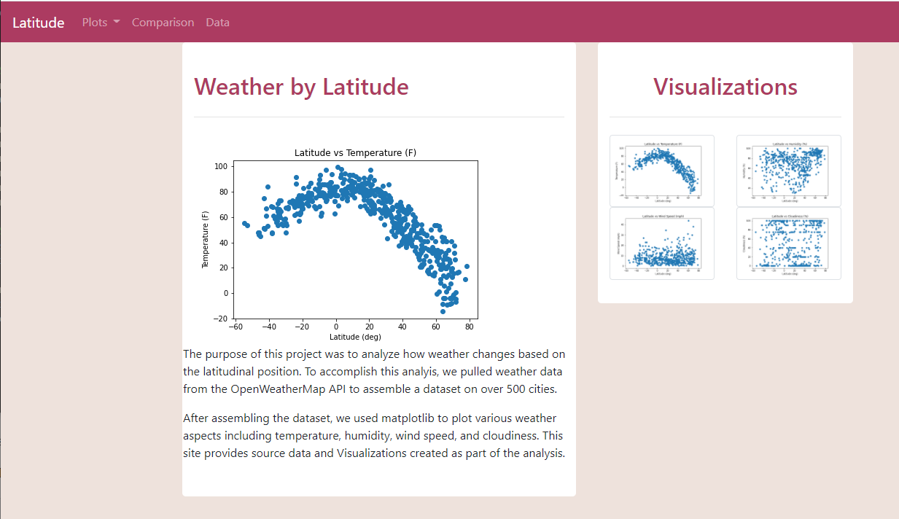
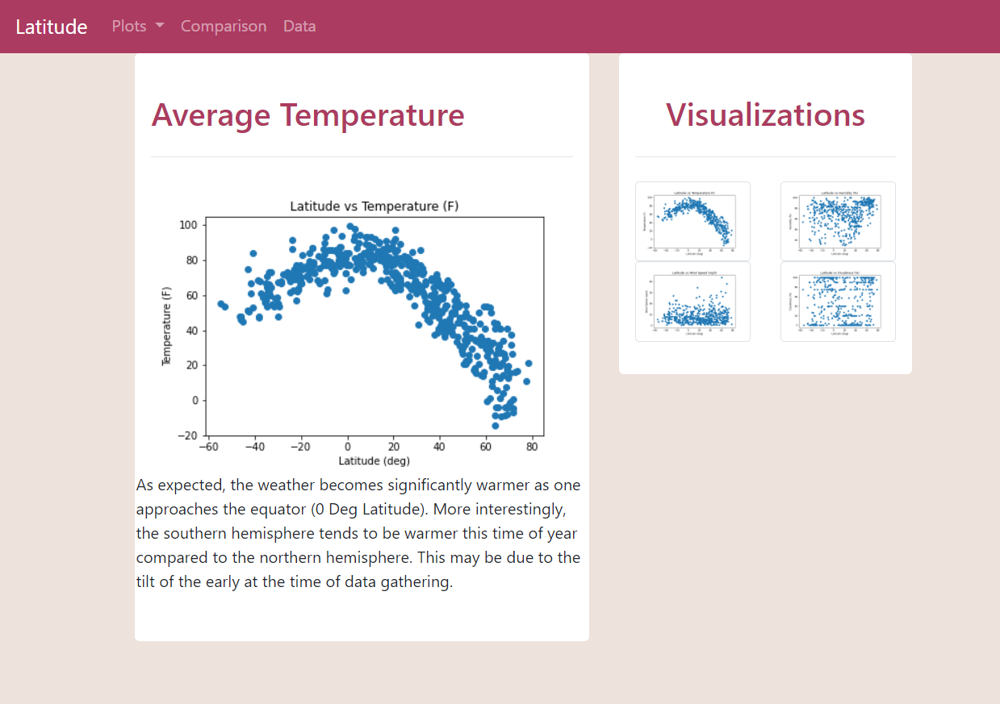
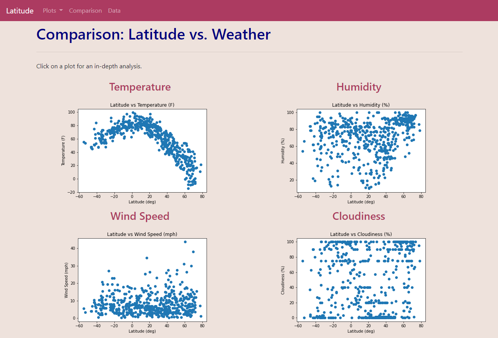
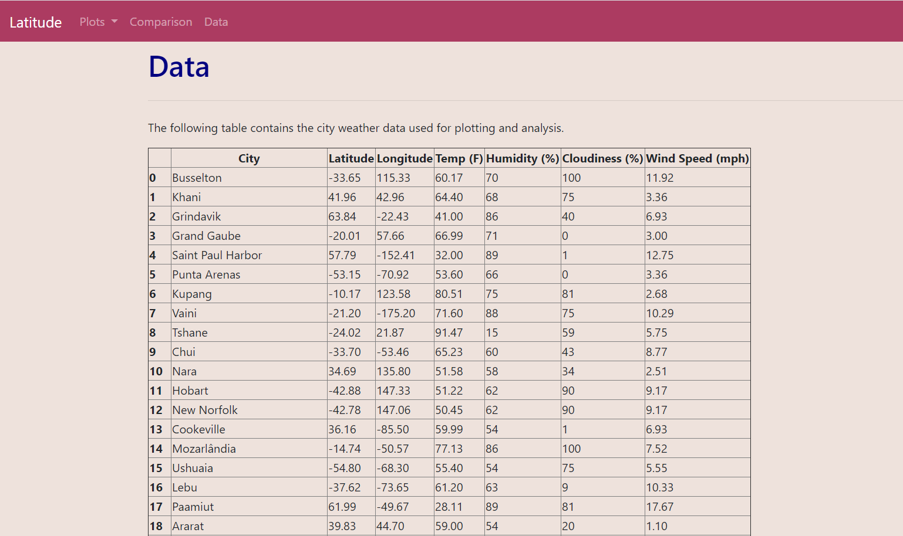

# Web-Design-Challenge

Web Visualization of weather in more than 500 cities comparing various aspects of weather to the latitudinal position of the city.  The weather aspects of humidity, temperature, wind speed, and cloudiness were compared and plotted with matplotlib and displayed in a webpage  using html, bootstrap, and CSS.

[Interactive Webpage](https://grand42.github.io/Web-Design-Challenge/WebVisualizations/Landing.html)

